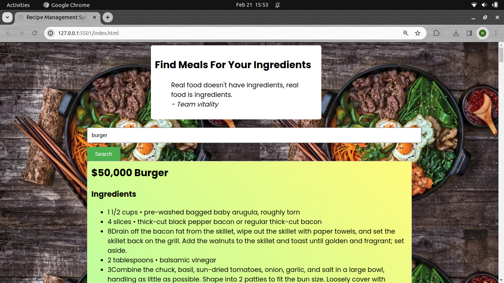

# Recipe Management System

## Overview
The Recipe Management System is a web application that allows users to search for recipes, view ingredients, instructions, and save their favorite recipes. The system utilizes the Spoonacular API to fetch recipe data.
## Features
Search Recipes: Users can search for recipes by entering keywords in the search bar.
View Recipe Details: The system displays recipe details including the title, ingredients, and instructions.
Save Favorite Recipes: Users can save their favorite recipes for future reference.
## Usage
Enter a keyword in the search bar and click the "Search" button.
View the recipe cards displayed on the page.
Click on a recipe card to view its details including ingredients and instructions.
Click the "Save Recipe" button to save a recipe as a favorite.
## Future Enhancements
Implement functionality to save favorite recipes to a user's profile.
Allow users to categorize and organize their saved recipes.
Incorporate user authentication for personalized experiences.
## Dependencies
Spoonacular API: Used to fetch recipe data.
#Known Issues
Limited API usage may result in occasional 402 errors indicating "Payment Required".
